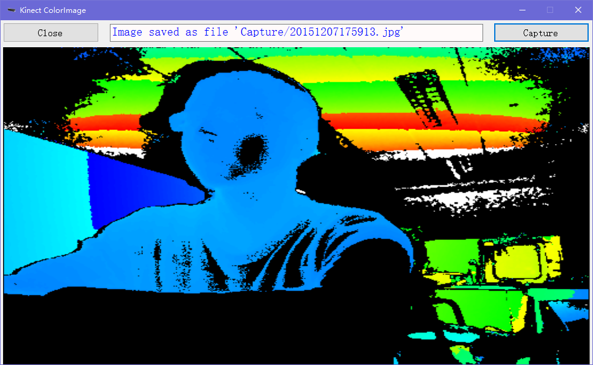
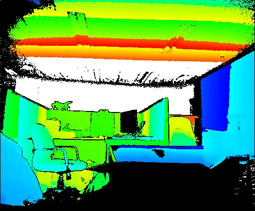

## KinectV2 - KinectDepthImage

Development on KinectV2 (Kinect for XBOX One)

Details can be found at this [link](http://github.com/fengyhack/KinectV2).

实现功能：从Kinect设备获取深度图像(DepthFrame)并显示.

开发环境： Visual Studio 2013 + WinForm(.NET 4.5) + Kinect SDK 2.0

